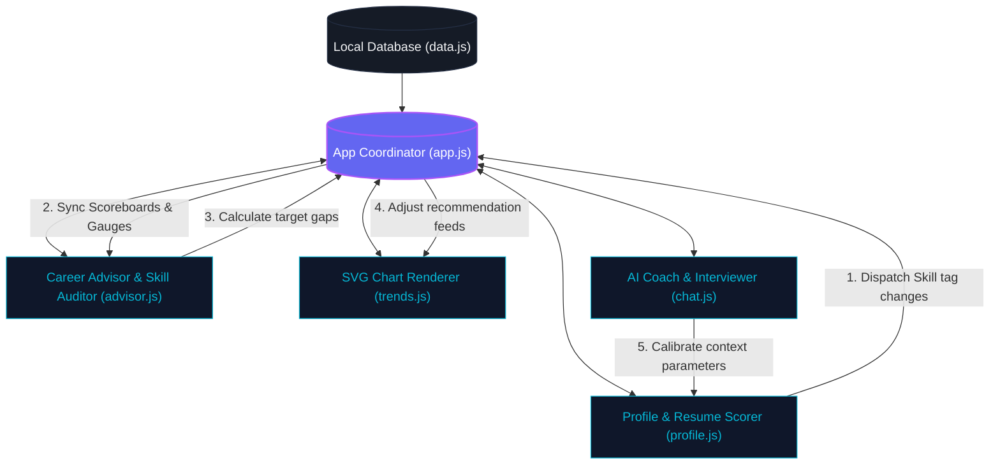

# 🌟 Aura Career Intelligence: Interactive AI Career Advisor & Planner

> **GDG Noida AI Hackathon Submission**
> Aura fuses job postings, candidate profiles, and labor-market trends into personalized, actionable guidance, acting as an active career strategist rather than just another search board.

[](https://github.com/iampankajver/gdg-noida-ai)
[](https://developer.mozilla.org/en-US/docs/Web/JavaScript)
[](#)

---

## 📺 Application Showcase & Architecture

Aura leverages a fully self-contained, offline-first client architecture using **object-oriented modular ES6 classes**. The coordination between the tabs, state transitions, and interactive modules is illustrated below:



---

## 🚀 Key Interactive Hackathon Visual Features

Aura was engineered with a suite of custom features explicitly calibrated to create an outstanding impression during hackathon evaluations:

### 1. Interactive Resume Editor & Floating Tooltip Fixes
* **The Wow Factor:** In the **Profile & Resume** tab, users paste their raw resume text. Clicking **Interactive Fix Highlights** processes the text and highlights syntax errors, weak words (e.g. *"Worked on"*), or passive voice patterns.
* **Click-to-Fix:** Clicking any highlighted term opens a floating tooltip cards offering dynamic adjustments (e.g. swap *"Worked on"* for *"Engineered"*). Clicking **Auto Replace** replaces the term in the text editor, recalculating scores dynamically in real-time.

### 2. Custom Job Description Calibrator & Matcher
* **The Wow Factor:** In the **Career Advisor** tab, candidates paste arbitrary job requirements from any corporate website. The engine scans the text, isolates the required technologies, assesses your alignment, and populates a tailored checklist timeline matching *only* the gaps.

### 3. AI Voice Coach (Text-to-Speech & Neon Wave Canvas)
* **The Wow Factor:** In the **AI Coach Nova** tab, users can toggle the **Microphone** button. Nova's conversational replies are synthesized using the native **Web Speech API (`SpeechSynthesis`)** and spoken out loud.
* **Synchronized Soundwaves:** When speaking, an HTML5 `<canvas>` rendering loop draws a glowing, animating neon sine wave that visualizes the speech frequencies in real time, reverting to a gentle vibration when silent.

### 4. Lightweight SVG Charts
* **The Wow Factor:** No heavy charting packages (like Chart.js or Recharts) that fail to render offline. Aura renders **100% vector-based SVG charts** (Hiring Speed Line Graphs & Salaries Bar Charts) complete with custom mouseover tooltip coordinates.

---

## 📂 File Architecture

```
gdg-noida-ai/
├── index.html                  # Main layout container & tab view frames
├── README.md                   # Hackathon master documentation
├── css/
│   └── styles.css              # Custom variables, glassmorphism card layouts, voice waves, and keyframes
└── js/
    ├── data.js                 # Career tracks schemas, course templates, and dialog transcripts
    ├── profile.js              # Tags controller, ATS scoring, and floating redlines tooltips
    ├── trends.js               # Mathematical scaling and dynamic SVG graph plotting
    ├── advisor.js              # Cosine similarity gap auditing and custom job scrapers
    ├── chat.js                 # Chat dialogues, mock interview cycles, and audio engines
    └── app.js                  # Global event routing and state sync loops
```

---

## 🛠️ Getting Started

Aura uses pure client-side vanilla standard APIs, meaning **it requires absolutely zero build installations, webpack bundles, or npm modules**.

### Option A: Local Browser Launch
Simply double-click `index.html` or drag it into any modern web browser (Chrome, Safari, Edge, Firefox).

### Option B: Local Development Server
To launch with support for full speech synthesis voices loading, open a terminal in the project directory and run:
```bash
# Using Python
python3 -m http.server 8000

# Or using Node.js
npx serve .
```
Then navigate to `http://localhost:8000` in your web browser.

---

## 🌟 Hackathon Presentation Quick Demo Guide
For a 3-minute hackathon judge evaluation, run the following steps to highlight maximum interactivity:
1. **Show Market Pulse:** Walk through the **Dashboard** highlighting the radial gauge and how it matches user skills to Noida jobs.
2. **Scan and Fix Resume:** Go to **Profile**, click **Load Weak Resume**, and hit **Audit**. Point out the low score. Click the **Interactive Fix Highlights** tab. Click the highlighted word *"Worked on"*, click **Auto Replace**, and show the score instantly jumping up!
3. **Calibrate Custom Job:** Go to **Career Advisor**, copy/paste a job listing description (or use the preloaded text) in the **Calibrate Custom Job** card, click **Parse**, and show the system mapping a custom learning timeline.
4. **Talk to Nova:** Open the **AI Coach** tab, click **Toggle Nova Voice**, select the prompt **"Start a Mock Technical Interview"**, and listen to Nova speaking the first question out loud while the soundwave animates!
